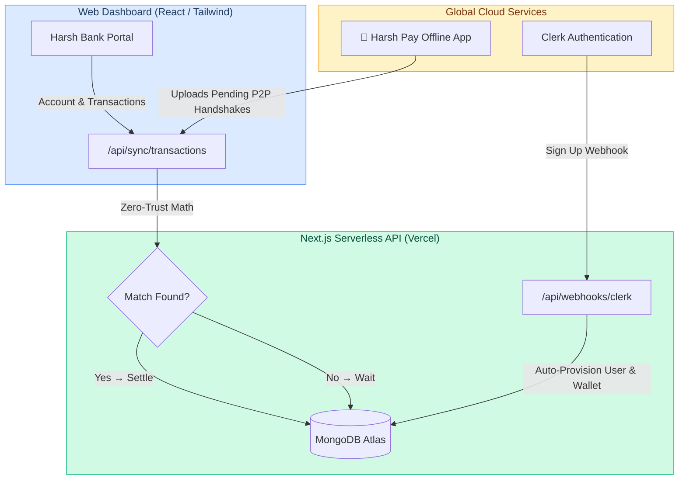

<div align="center">
  <h1>🏦 Harsh Bank Web Portal & Escrow API</h1>
  <p><strong>The Zero-Trust Cloud Command Center for the Harsh Pay Ecosystem</strong></p>
</div>

<br/>

## 🚀 Overview

**Harsh Bank** is the centralized cloud backend and user dashboard that powers the **Harsh Pay** offline payment network. It serves a dual purpose: 
1. Providing users with a premium, glassmorphism web dashboard to monitor their wallets and manage their Security Profiles.
2. Hosting the serverless **Zero-Trust Two-Way Escrow APIs** that process, verify, and mathematically settle offline peer-to-peer payments.

Built with **Next.js 14**, **MongoDB Atlas**, **Clerk Auth**, and **Tailwind CSS**.

### 🌐 Live Links
- **💻 Web Dashboard**: [https://harsh-bank.vercel.app](https://harsh-bank.vercel.app)
- **⚙️ Backend API Base**: `https://harsh-bank.vercel.app/api`
- **📱 Mobile App Repository**: [GitHub - Harsh-Pay-App](https://github.com/Harshkumar2306/Harsh-Pay-App)

---

## 🏗️ System Architecture



---

## 🌟 Features & Escrow Architecture

### 1. 🔐 Zero-Trust Settlement Engine
Because offline mobile devices cannot be trusted to deduct their own balances, this backend operates a strict Escrow system:
- When an offline phone finally connects to Wi-Fi, it POSTs an encrypted `clientTxId` (`UUID::ReceiverID::SenderID`) to the `/api/sync/transactions` endpoint.
- The backend places this transaction in a **PENDING Escrow State**.
- The backend actively queries MongoDB to find the matching transaction uploaded by the *other* party.
- Only if the **Amount, Sender, and Receiver identically match**, and the payload is under 24 hours old, does the server atomically alter cloud balances.

### 2. ⚡ Event-Driven Provisioning
When a user signs up on the frontend via **Clerk**, a webhook is fired to the backend. The API securely creates a MongoDB User document and provisions a starting `Wallet` balance, completely bypassing the client.

### 3. 🎨 Ultra-Premium Dashboard UX
Built with Tailwind CSS and Framer Motion.
- Glassmorphism design elements, blurred backdrops, and gradient overlays.
- A **Security Profile** tab allowing users to reveal their secure `App Sync ID` QR code to pair their offline mobile application.

---

## 🛠️ Local Setup & Testing

### Prerequisites
* **Node.js** (`18+`)
* **MongoDB Atlas** account (Free Tier)
* **Clerk** account for Authentication

### 1. Environment Setup
Clone the repository and create a `.env.local` file:
```bash
git clone https://github.com/Harshkumar2306/Harsh-Bank.git
cd Harsh-Bank
npm install
```

Configure your `.env.local`:
```env
NEXT_PUBLIC_CLERK_PUBLISHABLE_KEY=pk_test_...
CLERK_SECRET_KEY=sk_test_...
MONGODB_URI=mongodb+srv://...
WEBHOOK_SECRET=whsec_...
```

### 2. Run the Development Server
```bash
npm run dev
```
Navigate to `http://localhost:3000` to view the dashboard!

---

## ☁️ Cloud Deployment (Vercel)

This application is optimized for Edge/Serverless deployment on Vercel.
1. Push this repository to GitHub.
2. Import the project into your Vercel Dashboard.
3. Paste in all Environment Variables from your local setup.
4. Hit Deploy. Vercel will instantly host your Dashboard globally and scale your `/api` routes serverlessly.

---

## 📁 Project Structure

```text
harsh_bank_web/
├── src/
│   ├── app/
│   │   ├── (dashboard)/        # Secured Web UI (Home, Transactions, Security)
│   │   ├── api/
│   │   │   ├── sync/           # Mobile App Polling Endpoints
│   │   │   ├── pay/            # Real-Time Online UPI APIs
│   │   │   └── webhooks/       # Clerk Event Listeners
│   │   ├── models/             # Mongoose DB Schemas (User, Wallet, Transaction)
│   │   └── lib/                # MongoDB Connection Utilities
│   └── components/             # Reusable UI Blocks (Navbars, Modals)
```

---

## 🧪 Core API Endpoints

| Method | Endpoint | Description |
| :--- | :--- | :--- |
| `POST` | `/api/sync/wallet` | Returns the user's mathematically verified cloud balance and transaction history. |
| `POST` | `/api/sync/transactions` | The Two-Way Escrow Engine. Receives pending mobile payloads, executes Zero-Trust Math, and settles accounts. |
| `POST` | `/api/pay/online` | Facilitates instant, online transactions (bypassing escrow) like UPI. |
| `POST` | `/api/webhooks/clerk` | Secure webhook listener for user provisioning and identity sync. |

---

<div align="center">
  <i>The uncompromising backbone of the Harsh Pay Network.</i>
</div>
